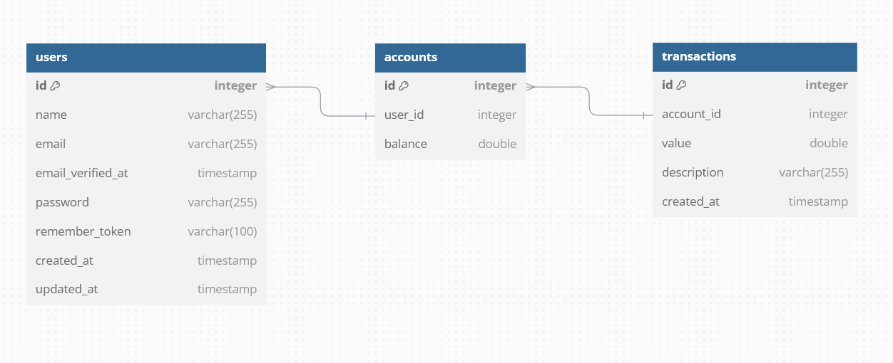

## Задание
"Биллинг"

Требования
- PHP 8, Laravel 11
- Postgres / Mysql

Структура БД

Структура таблиц БД, миграции:
- таблица пользователей
- таблица баланса пользователя
- таблица операций

Создание API, описание swagger (методы):
-  регистрация пользователя
-  информация о пользователе (включая баланс)
-  выполнение операций(пополнение/списание)  пользователем (не давать уходить в отрицательный баланс)
-  история операций (возможность менять сортировку по дате и поиск по описанию)

По желанию можно использовать очереди для реализации списания\пополнения

Результат должен быть выложен в Git с открытым доступом, любой на выбор

## Запуск проекта через Docker (Sail)
~~~
./vendor/bin/sail up
./vendor/bin/sail composer install
~~~
После этого можно заполнить базу
~~~
./vendor/bin/sail php artisan migrate --seed
~~~

## Структура базы

